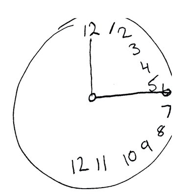

# 03.10.2022 - Reading Notes/Hemispatial neglect

Hemispatial neglect is a neuropsychological condition in which, after suffering damage to one side of the brain, the person's awareness of the opposite side is reduced. For example, if the brain's right side was damaged after a stroke, it wouldn't notice the left side.

There're two types of neglect:

- __Egocentric neglect:__ If the person suffers egocentric left neglect, they can only see the coffee mug placed on the right side of the table in front of them.
- __Allocentric neglect:__ If the person suffers allocentric left neglect, they can only see the right side of the coffee mug no matter where it is.

So a person with left neglect will only eat the right side of the dish, read from the middle of the page, and when requested to draw a clock, they would cram the numbers onto the right side of it.

While the awareness deficit is quite noticeable to the observer, the patient has no recognition of the problem. They often deny or do not know that there is something wrong with their perception. Imagine the feeling of not knowing what is behind you, and stretch that unawareness to the middle of your face. That is how people with hemispatial neglect perceive their surroundings.

__References:__

- [https://en.wikipedia.org/wiki/Hemispatial_neglect](https://en.wikipedia.org/wiki/Hemispatial_neglect)
- [https://jnnp.bmj.com/content/75/1/13](https://jnnp.bmj.com/content/75/1/13)
- [https://tactustherapy.com/what-is-left-neglect/](https://tactustherapy.com/what-is-left-neglect/)
