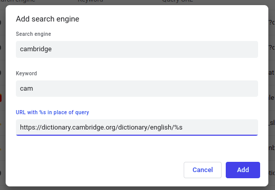

# 03.10.2022 - Productivity/Chrome custom search engine

Chrome custom search engine is a way to make a "shortcut" for a URL. This is especially convenience when you want to quickly access a URL with a dynamic input.

For example, let's say you want to quickly look up a word in Cambridge dictionary and the URL format of the dictionary is:

```
https://dictionary.cambridge.org/dictionary/english/[WORD YOU WANT HERE]
```

You can add a new search engine in `chrome://settings/searchEngines` with the following settings:



And then you can start using the search engine by typing in the keyword. Hit tab and enter the word you wanted look up:


